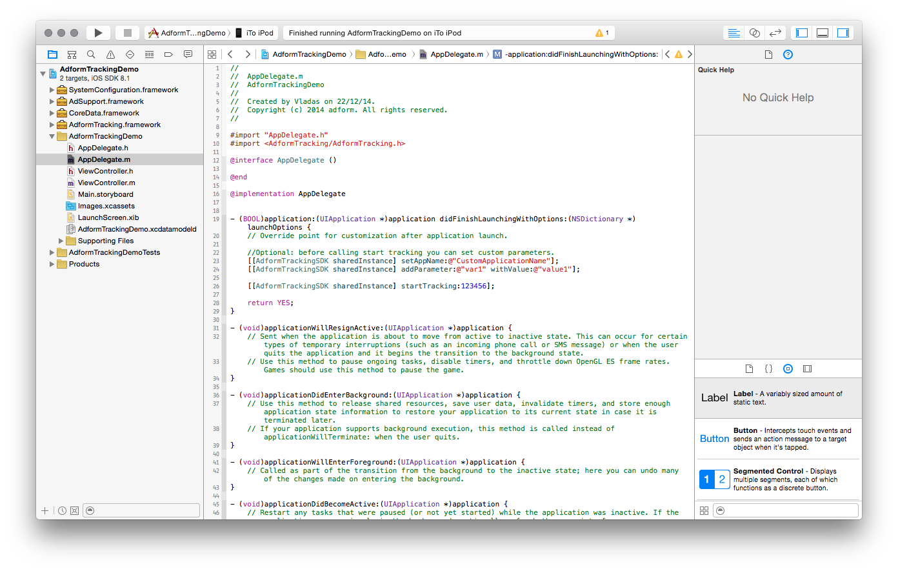
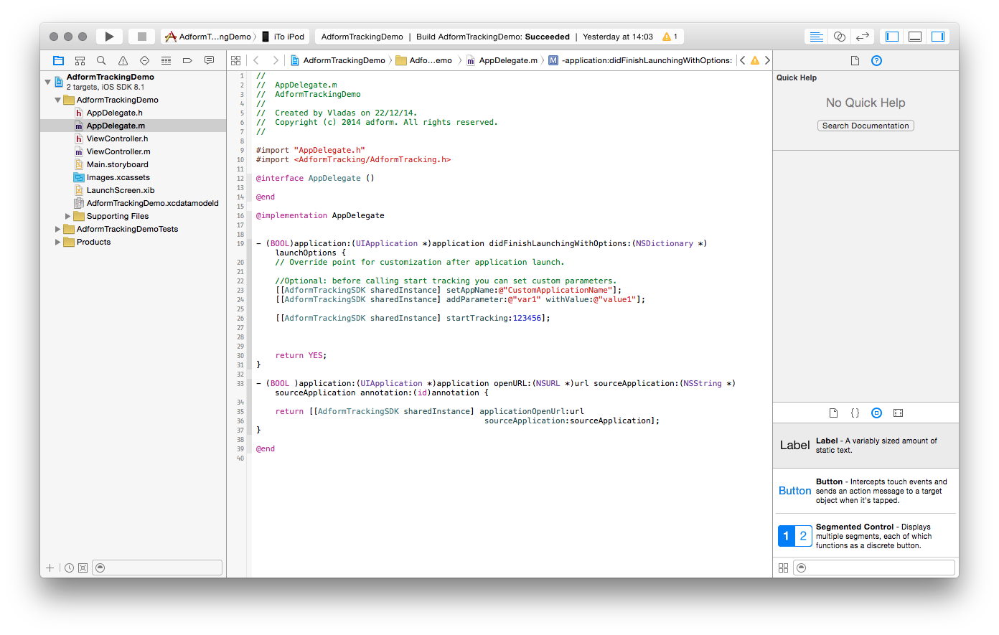

# Getting Started

When you run mobile campaigns, boost of new app installs are often one of the main goals. We are happy to announce that today we are launching app installs solution for iOS and Android devices. Easy to install SDK will enable campaign app installs tracking and reporting in Adform platform without need to deal with 3rd party SDKs and invest tons of time into that.

## 1. General Info

The use of Adform Tracking SDK requires the following:

* Xcode 5.0 or later.
* iOS SDK 7.0 or later.
* Requires deployment target 6.0 or later.
* Requires ARC to be enabled. 

## 2. Integration

### 2.1. Using CocoaPods

Adform Tracking SDK is now available via CocoaPods. CocoaPods is a very popular Objective-C dependency management tool. 

* To use CocoaPods, you should first install the CocoaPods Ruby Gem (CocoaPods is built with Ruby):

````
$ sudo gem install cocoapods
````

* Next, you need to create a `Podfile`, which describes what dependencies you project has. This file should be placed in your project directory. 

````
$ pod init
````

* Next, edit `Podfile` and add the platform identifier and the list of libraries you want to use in the project. 

````
platform: ios

pod 'AdformTracking'
````

* Finally, you have to install the selected libraries.

````
pod install
````
Thats it!

For more information about CocoaPods visit [CocoaPods site](http://cocoapods.org/about).


### 2.2. Manual

* Download latest build version of Adform Tracking SDK.
* Drag **AdformTracking.framework** to your project.


* When asked select **Copy items into destination group's folder**.


* Go to your application target’s configuration > General > Linked Frameworks and Libraries section and add these frameworks to your project:

   * **AdSupport.framework**
   * **CoreData.framework**
   * **SystemConfiguration.framework**


* Go to your application target’s configuration > Build settings > Linking > Other Linker Flags, and set **-ObjC** flag.


## 3. Basic Adform Tracking SDK implementation

* Import `AdformTracking/AdformTracking.h` in `AppDelegate.h`

* In `application:didFinishLaunchingWithOptions:` method call `startTracking:` method with your tracking point id.

````
    [[AdformTrackingSDK sharedInstance] startTracking:123456];
````

Thats it! You are ready to go.


* Optionally you can set custom application name and parameters before calling `startTracking:`.

````
    [[AdformTrackingSDK sharedInstance] setAppName:@"CustomApplicationName"];
    [[AdformTrackingSDK sharedInstance] addParameter:@"var1" withValue:@"value1"];
    
    [[AdformTrackingSDK sharedInstance] startTracking:123456];
````



## 4. Custom Adform Tracking SDK implementations

* For sending tracking events manually you need to import `AdformTracking/AdformTracking.h` in any class you want to send events from, in provided example we use `ViewController.h`.

* Create a `TrackPoint` instance with your track point id, set section name, custom parameters and send the track point.

````
    TrackPoint *trackPoint = [[TrackPoint alloc] initTrackPoint:123456];
    
    [trackPoint setSectionName:@"Custom Section Name"];
    
    [trackPoint addParameter:@"var1" withValue:@"Custom Variable 1"];
    [trackPoint addParameter:@"var2" withValue:@"Custom Variable 2"];
    [trackPoint addParameter:@"var3" withValue:@"Custom Variable 3"];
    
    [[AdformTrackingSDK sharedInstance] sendTrackPoint:trackPoint];
````


## 5. Limit tracking

You can disable the Adform Tracking SDK from tracking any events by calling `setEnabled:` with parameter `NO`. This setting is remembered between application launches. By default tracking is enabled.

````
    [[AdformTrackingSDK sharedInstance] setEnabled:NO];
```` 

You can check if tracking is enabled by calling `isEnabled` method.
 

## 6. Deeplink tracking

Adform Tracking SDK uses deep-link tracking to attribute part of Facebook events. You should implement it if you are going to use our SDK for Facebook tracking.

The implementation is very simple, you just have to call `AdformTrackingSDK` method `applicationOpenUrl:sourceApplication:` in your `AppDelegate` class's method `application:openURL:sourceApplication:annotation:` and pass url and sourceApplication parameters.

````
- (BOOL )application:(UIApplication *)application openURL:(NSURL *)url sourceApplication:(NSString *)sourceApplication annotation:(id)annotation {
    
    return [[AdformTrackingSDK sharedInstance] applicationOpenUrl:url
                                                sourceApplication:sourceApplication];
}
````


